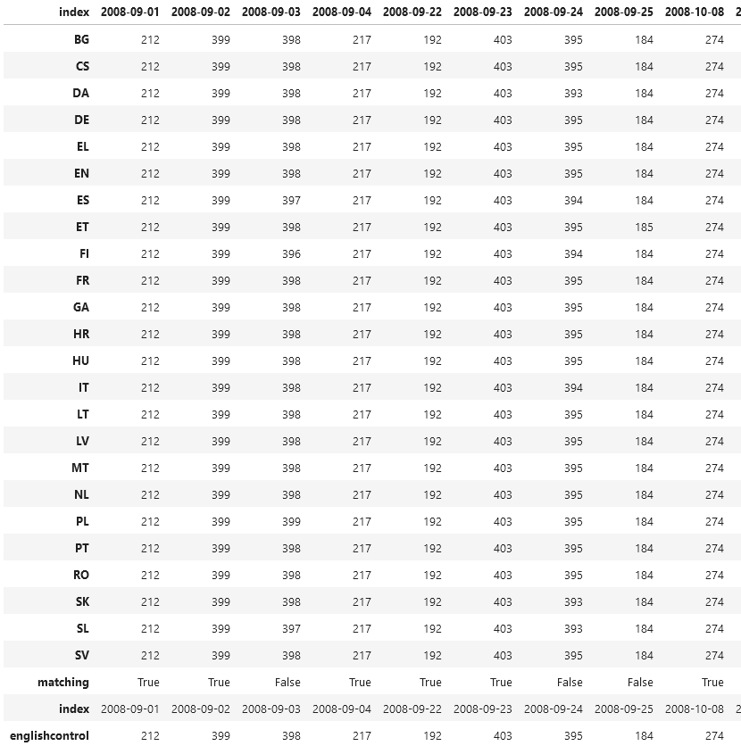
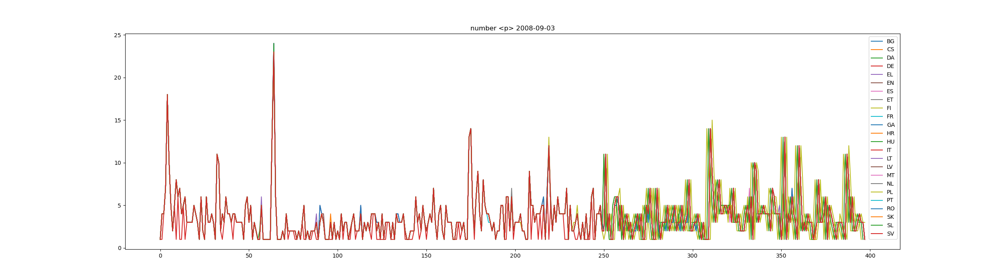

# Purpose

This is taking plenary verbatim reports from europarl and processs them into pickles / .csv files.

This results in a "xx_unrefined" pickle per language that contains:
    {session_date : ['agenda_item', 'text', 'speaker', 'number_p', 'number_w', 'chair', 'language_ps', 'ps']}

Or a csv file with the session date as file name and the columns as above.

# Problem
There are a number of problems with this:
Basically not all languages have the exact same number of speeches in their verbatim reports.
This is usually caused by unpredictable human interference with the europarl database: 
    - sometimes there are table rows that contain only *** or other sign combinations
    - very rarely speeches are split in one language, but in no other language
    - ...

Disagreement happened in about 1/3 of the speeches in about 3 random languages:
 "Image of Data frame")

It can be clearly seen that when this happens, then is likely to happen in parallel:
 "Image of Data frame")

This could be used to determin relay translations.

# Further work
I have been using the Python sequence matcher with whisper transcripts to find the corresponding 
speeches. Therefore it was not important to have all languages agree 100% on the speech ordering.

If I have a use case for exact 